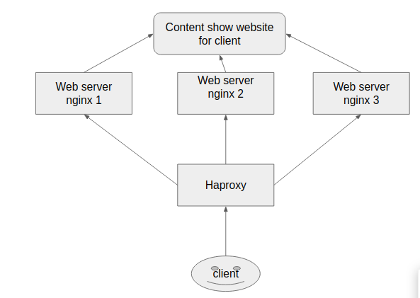

# haproxy_easyadmin

HAProxy is free, open source software that provides a high availability load balancer and proxy server for TCP and HTTP-based applications that spreads requests across multiple servers.It is written in C and has a reputation for being fast and efficient (in terms of processor and memory usage).

HAProxy is used by a number of high-profile websites including GoDaddy, GitHub, Bitbucket, Stack Overflow, Reddit, Slack, Speedtest.net, Tumblr, Twitter and Tuenti and is used in the OpsWorks product from Amazon Web Services.

####  Examples of configurations are included in the example file(example haproxy for run docker and balance 3 web server), which is the corresponding docker file

</img>

## This repository is updated

