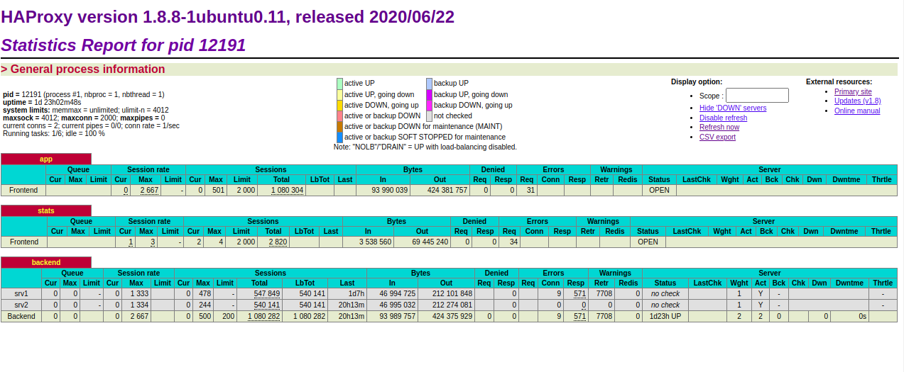

### example config

## node-exporter for monitoring haproxy with prometheus

```

docker container run -d -p 9101:9101 quay.io/prometheus/haproxy-exporter:v0.9.0 --haproxy.scrape-uri="http://ip_address:8181/stats;csv

``` 

## step1
install ubuntu os

## step2 

apt update && apt upgrade

## step3 

apt install haproxy

## step 4

apt install docker.io

# step 5 

change config haproxy .cfg

```

#global
#       log /dev/log    local0
#       log /dev/log    local1 notice
#       chroot /var/lib/haproxy
#       stats socket /run/haproxy/admin.sock mode 660 level admin expose-fd listeners
#       stats timeout 30s
#       user haproxy
#       group haproxy
#       daemon

        # Default SSL material locations
#       ca-base /etc/ssl/certs
#       crt-base /etc/ssl/private

        # Default ciphers to use on SSL-enabled listening sockets.
        # For more information, see ciphers(1SSL). This list is from:
        #  https://hynek.me/articles/hardening-your-web-servers-ssl-ciphers/
        # An alternative list with additional directives can be obtained from
        #  https://mozilla.github.io/server-side-tls/ssl-config-generator/?server=haproxy
#       ssl-default-bind-ciphers ECDH+AESGCM:DH+AESGCM:ECDH+AES256:DH+AES256:ECDH+AES128:DH+AES:RSA+AESGCM:RSA+AES:!aNULL:!MD5:!DSS
#       ssl-default-bind-options no-sslv3


defaults
        log     global
        mode    http
        option  httplog
        option  dontlognull
        timeout connect 5000
        timeout client  50000
        timeout server  50000
        errorfile 400 /etc/haproxy/errors/400.http
        errorfile 403 /etc/haproxy/errors/403.http
        errorfile 408 /etc/haproxy/errors/408.http
        errorfile 500 /etc/haproxy/errors/500.http
        errorfile 502 /etc/haproxy/errors/502.http
        errorfile 503 /etc/haproxy/errors/503.http
        errorfile 504 /etc/haproxy/errors/504.http

frontend app
    bind *:1234
    use_backend backend

frontend stats
   bind *:8181
   stats enable
   stats uri /stats
   stats refresh 10s
backend backend
  server srv1 127.0.0.1:8585
  server srv2 127.0.0.1:8686


```

## step 6
after chnage haproxy.cfg 

haproxy -f /etc/haproxy/haproxy.cfg

## step 7
apt install prometheus

apt install grafana

## step 8 
chnage config prometheus for node-exporter haproxy
vim /etc/prometheus/prometheus.yml

### change config

``` 
# my global config
global:
  scrape_interval:     15s # Set the scrape interval to every 15 seconds. Default is every 1 minute.
  evaluation_interval: 15s # Evaluate rules every 15 seconds. The default is every 1 minute.
  # scrape_timeout is set to the global default (10s).

scrape_configs:
  # The job name is added as a label `job=<job_name>` to any timeseries scraped from this config.
  - job_name: 'prometheus'
    scrape_interval: 5s
    static_configs:
      - targets: ['localhost:9090']

  - job_name: 'node_exporter'
    static_configs:
      - targets: ['add ip-address:9100']

  #- job_name: 'cadvisor'
  #  scrape_interval: 5s
  #  static_configs:
  #    - targets: ['add ip-address:8080']

  - job_name: 'haproxy'
    static_configs:
      - targets: ['add ip-address:9101']


          #scrape_configs:
~                              

```
## default monitoring haproxy

http://add-ip-address:8181/stats

sync addree in docker for monitoring prometheus

http://add-ip-address:8181/stats;csv


</img>


